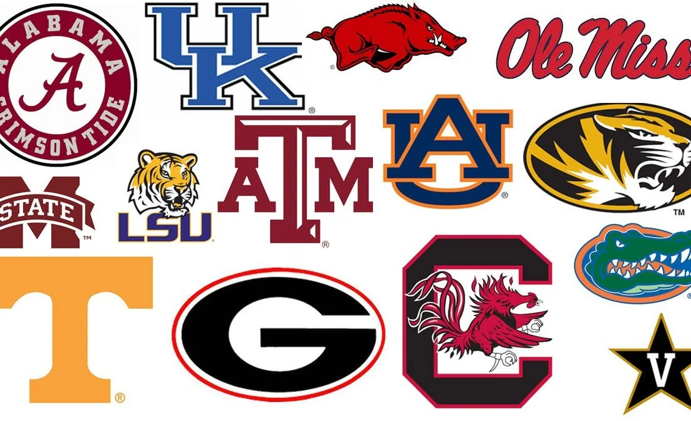

# Committing to Mizzou

After a quick switch from computer science to IT, I had finally figured out what I wanted to do, or so I thought. I had never coded before, and while the thought of coding interested me, but also frightened me at the same time. It seemed hard. Almost *too* hard. But I knew that I would try. 

Come senior year, it was time to submit my college applications. With a good ACT score and a lot of determination, I submitted my application to Mizzou. I remember my heart racing as I hit the submit button. *What if I don't get in?* It was hard thinking about rejection from my top school. The school that I had been dreaming about for most of my childhood.

For weeks after I submitted my application, I would constantly get the question, "So what **schools** did you apply to?" Accompanied by a disapproving, or confusing look when I answered with just the one. "That's it?" They would say. How could I waste my time applying to other schools when there was only one school that I *truly* wanted to be at?

Next Page: [Moving to Mizzou](page4.md)

[Back to Home](README.md)

